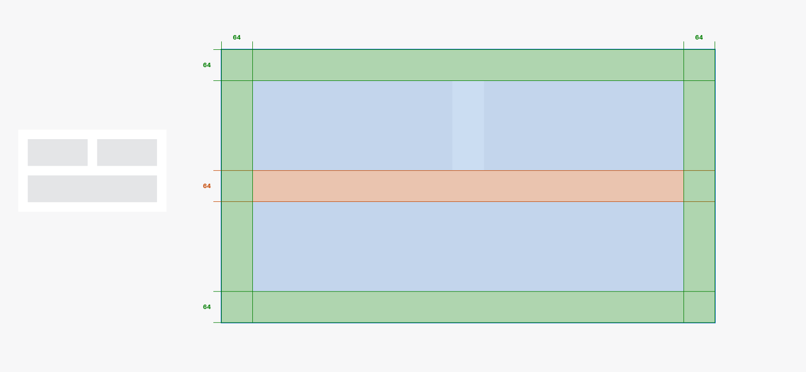
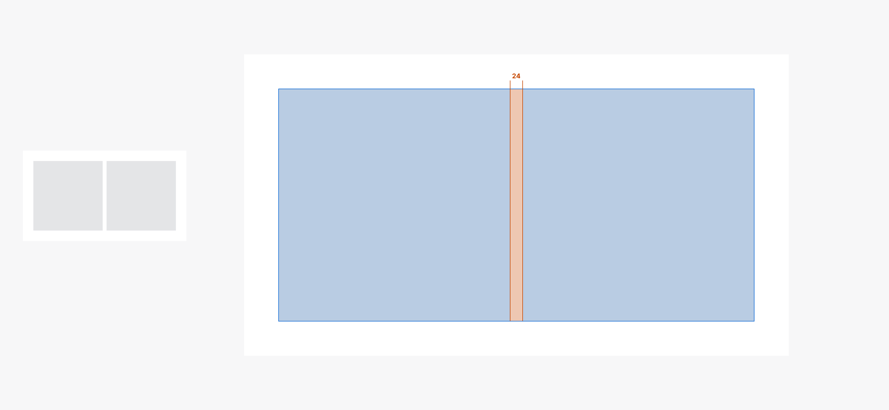
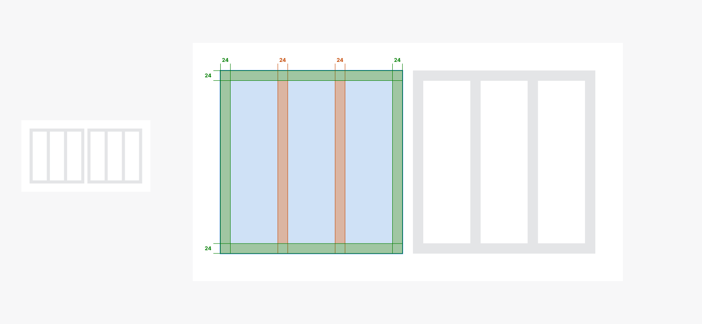

<PageHeader title="Avstander og luft" imagePath="avstander og luft" pageLevel=1></PageHeader>
TODO: Legg til tab komponent

# Avstander og luft

Avstand og layout er viktig element i grensesnittsdesign. Riktig bruk av avstand skaper orden, fremhever viktige elementer og forbedrer lesbarhet. Layout organiserer elementene for en intuitiv opplevelse. Sammen gir de et estetisk tiltalende og brukervennlig grensesnitt.

### Avstander

Fastsatte tokensbaserte avstander brukes for å gi konsistent mellomrom mellom komponenter og innhold på tvers av alle NVEs produkter.

### Lagkategorier

For at vi skal kunne bygge opp skisser på en måte som alle kan forstå må vi ha en struktur på hvordan man setter opp grensensittet. Vi deler opp lagstrukturen i flere deler.

## Avstandskategorier

Avstander i layout er avgjørende for å skape et ryddig og estetisk tiltalende design, samtidig som de bidrar til å forbedre brukeropplevelsen. I denne sammenhengen defineres avstander i tre hovedkategorier: Body Spacing, Container Spacing, og Element Spacing.

Samlet sett er riktig bruk av disse avstandskategoriene essensielt for å oppnå et visuelt tiltalende og funksjonelt design, samtidig som det gir en behagelig brukeropplevelse ved å skape organisert struktur og visuell balanse.

### Body Spacing

Body Spacing refererer til avstanden mellom body og container. Her opprettholdes en konsekvent padding på 64px rundt body, samtidig som det legges til en margin på 64px. Denne konsistente avstanden gir en helhetlig ramme og gir designet en visuell balanse.

### Container Spacing

Container Spacing omhandler avstanden mellom elementer som befinner seg innenfor body. Her fastsettes en margin på 24px mellom hver komponent eller element. Denne typen avstand gir en klar og organisert struktur uten å bruke padding rundt hvert enkelt element.

### Element spacing

Element Spacing refererer til avstanden mellom individuelle objekter innenfor en container. For å opprettholde lesbarhet, estetikk og en god brukeropplevelse, er det definert en spesifikk spacing mellom disse objektene. Denne avstanden bidrar til å forhindre sammenkobling av elementer og gir et luftig og ryddig utseende.

**Les om fler designelementer på**
<LinkButton URL="https://nve.frontify.com/" text="Profil og primitiver" :openInNewTab="true"/>
