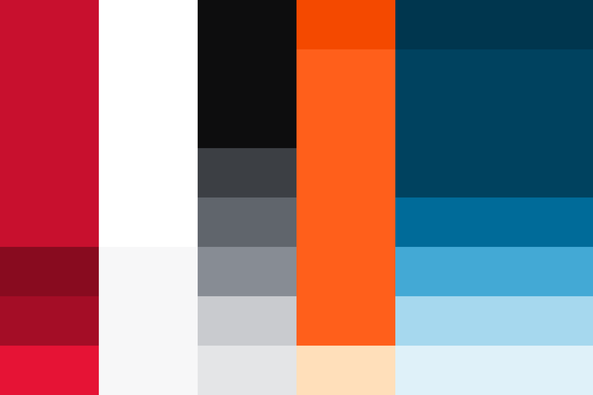

<PageHeader title="Farger" imagePath="tokens" ></PageHeader>

## Farger

Fargene er basert på NVEs og Varsoms profilmanualer, men i designsystemet har farger kontekstbaserte roller. Det vil si at fargene blir tildelt en rolle og kontekst, og at du må sørge for å bruke fargene riktig basert på rollen.

I designsystemet har farger kontekstbaserte roller. Det vil si at når du bruker fargene, må du bruke de i riktig kontekst. F.eks: Vil det stå om fargen brukes i elementer med forgrunn eller bakgrunn. Dette sikrere at fargene brukes i riktig kontekst og gjør det enklere å oppfylle kravene til universell utforming. Det gjør også at vi får et felles og konsekvent uttrykk på tvers av design.

### Fargekategorier

Vi har fire hovedkategorier:

TODO: Fikse disse kortene

 
    <Card variant="subtle-card" title="Neutrals">Farger som er veldig nøytrale og kategorisert med bruksnivå (primary, secondary). Det gir deg fleksibilitet i å velge mellom farger, samtidig som det er tydelig hvilke farge som er default.</Card>
    <Card variant="subtle-card" title="Interactive">Farger som brukes på interaktive handlinger. Knappene og linker bruker blandt annet disse fargene.</Card>
    <Card variant="subtle-card" title="Feedback">Feedback-farger som brukes i varslinger, status og tilbakemeldinger i grensesnittet.</Card>
    <Card variant="subtle-card" title="Danger level">Er den unike faregradskalaen som brukes for å varsle faregradene hos NVE og Varsom.</Card>

### Farger i designsystemet

#### Dette er fargene slik de er definert.

Man skal ikke bruke disse variablene direkte, men heller bruke andre variabler som bruker disse

<ColorList></ColorList>

Se også   https://www.designsystemet.no/grunnleggende/designelementer/farger
