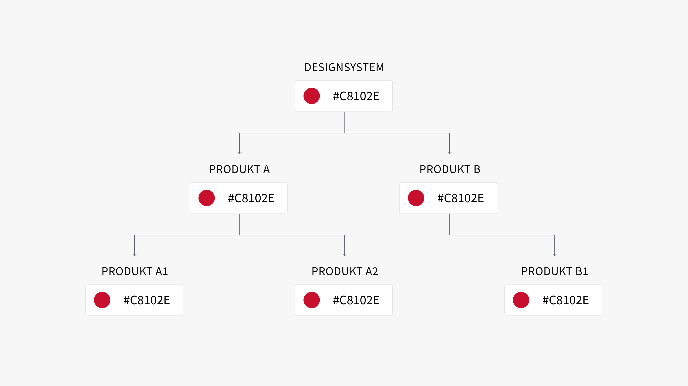
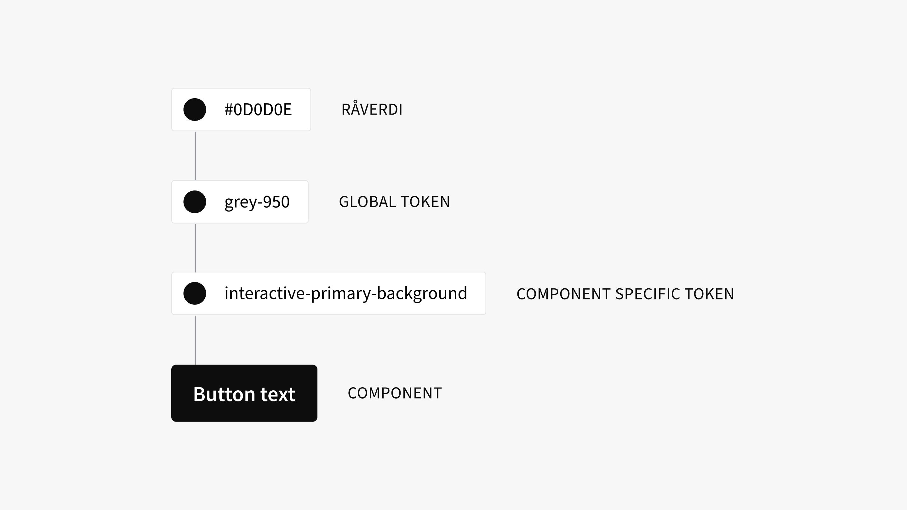

<PageHeader title="Tokens" imagePath="tokens" pageLevel=1></PageHeader>

### Designelementer

For å kunne jobbe med designsystemet er det noen par designelementer du burde gjøre deg kjent med. Tokens er elementer du måte komme til å forholde deg til fremover.

# Design tokens

Design tokens er en samling av "designegenskaper", som farger, typografi, luft og andre primitiver. Disse tokensene fungerer som byggeklosser for designsystemet, og gir en effektiv måte å organisere og implementere designbeslutninger på tvers av ulike plattformer og enheter. Ved å bruke design tokens kan designere og utviklere opprettholde en enhetlig visuell identitet mens de forenkler samarbeidet og tilpasningen til ulike deler av et prosjekt.

I NVE er design tokens en samling av standardiserte verdier som styrer utseendet og funksjonaliteten til elementene i vårt designsystem. Disse tokens dekker alt fra farger og typografi til avstander og formstørrelser. De lar oss tilpasse utseendet basert på våre merkevarefarger og visuelle stil, samtidig som de gir fleksibilitet til å oppdatere og vedlikeholde design effektivt. Dette gjør det mulig å tilpasse designet til ulike teknologier og verktøy, mens vi sikrer en konsistent og sømløs brukeropplevelse.

Samlet sett gir design tokens en strukturert tilnærming til designsystemet hos NVE, noe som gir en mer effektiv, konsistent og samarbeidsvennlig designprosess.

#### Bruk av tokens

Designsystemet har en tokenstruktur som brukes både i for deisgnere og kode.

For designere som jobber i Figma er det gjennom Figma sine "Variabler" du kan sette token på det du lager. Disse har helt lik struktur og navnkonvensjon som Token studio. Token studio er en plugin for Figma, som vi bruker for å holde oversikt og koble design verdier til tokens, som omskrives og publiseres opp til GitHub.

TODO: Bruke tokens som utvikler

### Tokensstruktur

#### Rå-verdier

Dataen knyttet til token-navnet. Dette er ikke tokens men endelig verdier (for eksempel: RGB-farger eller pikselverdier).

#### Global tokens (base-tokens)

Global tokens (base-tokens)
En token brukt på tvers av designsystemet. Dette er det motsatte av en komponentspesifikk token.

#### Alias tokens

Alias tokens
En token som refererer til en annen token, i stedet for å referere til en hardkodet verdi.

#### Component specific tokens

Component specific tokens
En token brukt for en bestemt komponent.

#### Private tokens

Private tokens
Tokenene i denne nivået lagrer vi ekstra rå verdiene vi ikke bruker og bygger oss en bank med verdier som kan brukes for videre ekspansjon og endringer.

**Les om fler designelementer på**
<LinkButton URL="https://nve.frontify.com/" text="Profil og primitiver" :openInNewTab="true"/>
