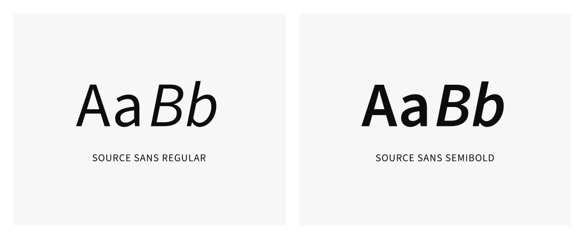

<PageHeader title="Typografi" imagePath="typografi" pageLevel=1></PageHeader>

Typografi er et av de sterkeste virkemidlene vi har for å lage visuelle hierarkier. For å sikre et konsekvent visuelt uttrykk på alle våre tjenester definerer designsystemet satte stiler på font-størrelse, font-vekt og linjeavstand. Vi bruker skrifttypen Source Sans i all kommunikasjon.

#### Source Sans

Source Sans Pro/3 er en «open-source» sans serif skrifttype, laget for å gi god lesbarhet på digitale produkter. I designsystemet bruker vi kun vektene Regular og Semibold, med tilhørende italics-versjoner.

#### Typografiske tokens

Typografiske tokens brukes for å opprettholde en ensartet samling av fonter i hele utviklingsprosessen.

#### Typografi i Figma

Fonten heter Source Sans Pro i Figma, og er tilgjenglig uten at du trenger å laste ned eller installere fonten selv.

#### Har du ikke fonten på maskinen?

Fonten heter Source Sans 3 i Google Fonts. Der kan du finne informasjon om hvordan fonten skal legges inn i kode på digitale produkter, og laste ned font-filer du kan installere på din maskin [her.](https://fonts.google.com/specimen/Source+Sans+3)

## Typografi-variabler

Vi tilbyr 7 fontstørrelsevariabler som er beregnet basert på dimensjonsvariabler, som igjen skaleres basert på skjermbredde (TODO: device tokens-seksjonen).

Vi bruker 4 brekkpunkter:

<ul>
<li><b>Desktop-large</b>: For store skjermer. Brekkpunkt: 1400px.</li>
<li><b>Desktop</b>: For vanlige stasjonære og bærbare datamaskiner.</li>
<li><b>Desktop-small</b>: For mindre skjermer, som små bærbare PC-er. Brekkpunkt: 1200px.</li>
<li><b>Mobile</b>: For smarttelefoner og andre små enheter. Brekkpunkt: 600px.</li>
</ul>

Under kan du teste hvordan fontene endres på ulike skjermbredder.

<TypographyTable tableContentType="default"></TypographyTable>

Basert på fontstørrelsevariablene har vi laget fontvariabler for bestemte formål: Overskrift, ingress, brødtekst, samt et par andre spesielle formål. Disse fontvariablene er grupperte CSS-`font` -egenskaper som kombinerer `font-weight`, `font-size`, `line-height` og `font-family` til en enkelt enhet. Ved å bruke disse variablene, sikrer vi at riktig linjehøyde og fontstørrelse benyttes, i tråd med universell utforming, designprinsipper og beste praksis.

I Figma-skisser blir disse font-egenskapene typisk brukt på ulike tekststiler og komponenter. For eksempel, header-stiler blir definert ved å bruke --heading- variabler, noe som sikrer en sammenhengende og standardisert tilnærming til typografi på tvers av design-systemet.

### Header

Header typografi variabler skal vanligvis brukes på html header-tagene som `<h1>`, `<h2>` osv.
<TypographyTable tableContentType="headers"></TypographyTable>

### Subheader

<TypographyTable tableContentType="subheaders"></TypographyTable>

### Ingress

<TypographyTable tableContentType="ingress"></TypographyTable>

### Body

<TypographyTable tableContentType="body"></TypographyTable>

### Body compact

<TypographyTable tableContentType="body-compact"></TypographyTable>

### Detail text

<TypographyTable tableContentType="detail-text"></TypographyTable>

### Label

<TypographyTable tableContentType="label"></TypographyTable>
