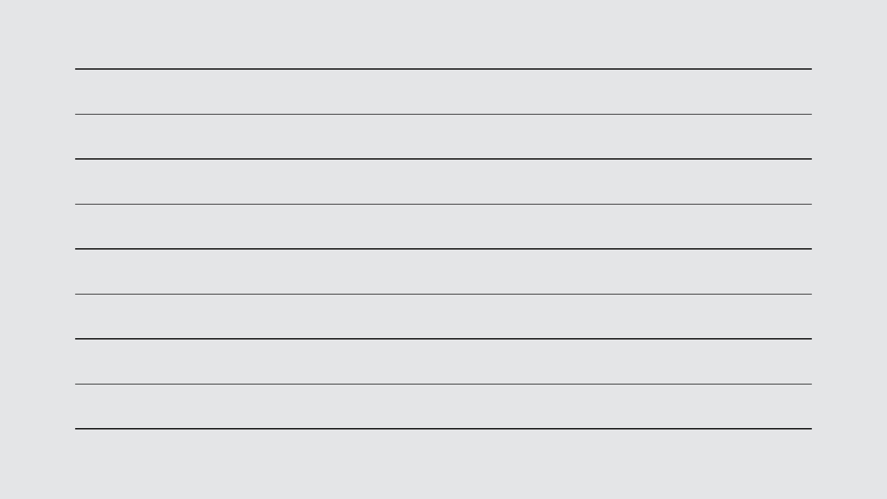
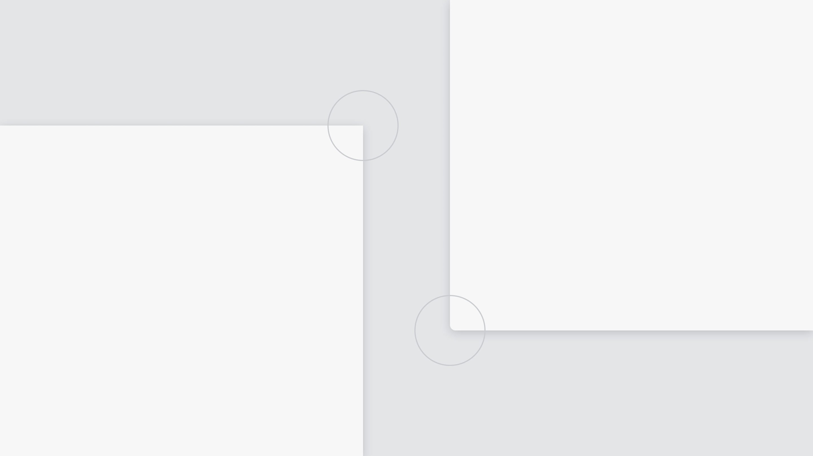
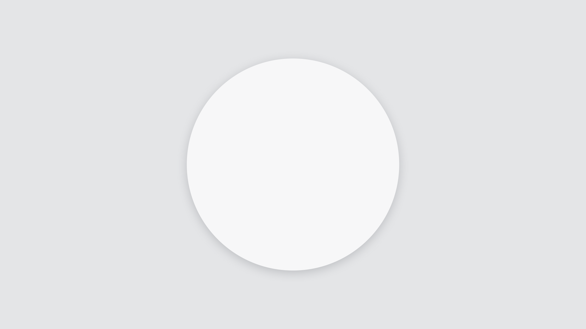

<PageHeader title="Visuell form" imagePath="designer" />

Her finner du designsystemet retningslinjer for border width, border radius og skygger.

## Border width

Det er to alternative tykkelser på border i designsystemet: Default og Strong. Default er standard-tykkelsen, og brukes i de fleste tilfeller. Strong brukes når en border har behov for kontrast til default-borders, og skal skille seg ut. Bruk farge for å lage et større hierarki i borders.

 

## Border radius

Border radius brukes konsekvent for å skille mellom elementer som er interaktive og ikke interaktive. Vi deler objekter inn i to kategorier: “Container” og “Interactive”.

 

### Container

Containers er objekter som ikke er interaktive, og de skal aldri ha avrundede hjørner (borderRadius.none).

### Interactive

Interactive er interaktive objekter, som skal ha avrundede hjørner. Disse kan også deles inn i to kategorier: Interactive Small og Interactive Large. Interactive Small er små interaktive objekter som skal ha en 4px border radius. Interactive Large er større interaktive objekter som skal ha en 6px border radius.

## Skygger

Skygge brukes til å få et element til å skille seg ut fra overflaten for å skape dybde. NVE har ett “flat” design, og skygger skal kun brukes på elementer som ligger over andre elementer, som f.eks. en sticky knapp som alltid ligger over annet innhold på siden. Skygge skal brukes forsiktig og kun på overlegg.

 

Du kan bruke to nivåer med skygge: Soft og Hard. Soft brukes på overlappende elementer når bakgrunnen er nedtonet og hovedsaklig består av lyse og nøytrale farger. Hard brukes på overlappende elementer når bakgrunnen er støyete og består av mange ulike farger, som f.eks. over et kart eller et bilde.

**Les om fler designelementer på**
<LinkButton URL="https://nve.frontify.com/" text="Profil og primitiver" :openInNewTab="true"/>
