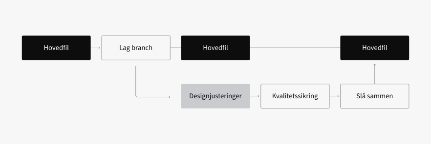

<PageHeader title="For designere" imagePath="designer" ></PageHeader>

## Bidrag

Designsystemet er et levende produkt som stadig forbedres. Vi ønsker at alle skal bidra til å gjøre det levende, og at nye behov og ønsker løses i designsystemet. Du bidrar inn i designsystemet ved å legge til nye features, forbedre eksisterende komponenter eller rapportere bugs og feil.

## Typer bidrag

Det er tre ulike måter du kan bidra til designsystemet på. Du kan legge til nye features, forbedre eksisterende komponenter eller rapportere bugs og feil.

  
  

    <h2 class="h2-style">Legg til</h2>
    
Har du skisset opp nye komponenter du ser blir mye brukt i NVEs tjenester og kan nytte andre prosjekter? Da ønsker vi veldig gjerne at du lager en sak i Jira hvor du legger ved skissen din. Velges den for utvikling, lager du komponentet gjennom en branch i Figma og kode. Er du fornøyd, markerer du den som ferdig i Jira. Da går saken over til designsystem-kvalitetsikrer, som har ansvar for kvalitetsjekk og publisering.

  

  
  

    <h2 class="h2-style">Forbedring</h2>
    
Dekker ikke et eksisterende komponent hele ditt behov eller har du en ny og bedre idé på hvordan komponenten bør fungere? Legg inn saken i Jira. Velges den for utvikling, lager du en branch i Figma og forbedrer komponenten. Er du fornøyd, markerer du den som ferdig i Jira. Da går saken over til designsystem-ansvarlig, som har ansvar for kvalitetsjekk og publisering.

  

  
  

    <h2 class="h2-style">Bugs og feil</h2>
    
Opplever du bugs eller noe feil fra komponenter i designsystemet? Det kommer til å skje i blant. Meld fra via Jira, så vil designsystem-kvalitetsikrer ta over saken og undersøke feilen.

  

## Bidragsprosess

### Enkle saker

For spørsmål og avklaringer er Teams et utmerket verktøy. Du kan enkelt stille spørsmål og dele tanker på FUX-kanalen, der hele produktutviklingsmiljøet hjelper hverandre med både små og store utfordringer. Hvis kanalen ikke passer for deg, kan du også kontakte de ansvarlige for design og kode via e-post.

### Komplekse saker

Hvis du trenger å gjøre endringer på eksisterende komponenter eller bygge nye, ønsker vi å ta en samtale med deg. Sammen vil vi vurdere kompleksiteten i oppgaven og hva teamet ditt har kapasitet til. Vårt mål er å unngå at designsystemet blir en flaskehals i produktutviklingen. Derfor ønsker vi å avklare hvordan teamet ditt kan bidra med konsept, design og kode.

### Eksempler på hvordan samtalen kan utvikle seg

#### Endringen er kun relevant for ditt team

Teamet ditt utvikler en lokal komponent. Vi holder dialogen gående og vurderer om andre team får samme behov senere.

### Endringen er enkel, og andre team har lignende behov

Teamet ditt kan foreslå endringen i designsystemet, hvor ansvarlige vurderer om det er verdt å investere tid og ressurser i videre utvikling. Dette gjøres ved å opprette en branch.

#### Endringen er kompleks, eller det skal bygges en ny komponent

Teamet ditt og designsystemansvarlige samarbeider om en løsning, og vi fordeler arbeidsoppgavene i fellesskap.

### Hvordan bidra?

Designsystemet er en felles dugnad fra og for alle prosjekter i NVE. Derfor er vi avhengig av bidrag for å bygge og forbedre designsystemet. Her forklarer vi hvordan du kan bidra.

1. **Før du starter**  
   Sjekk alltid om det er en komponent eller et mønster som dekker dine behov. [Figma](https://www.figma.com/files/1033298377581647627/project/85006605/Public---Designsystem?fuid=1201899461213591908) er et flott sted å starte. Her finner du en oversikt over alle komponenter og profilelementer, og du finner beskrivende eksempler. Ta gjerne kontakt via Teams hvis du er usikker.

2. **Rapporter i Jira**  
   Opplever du at det er noe som mangler, er utydelig eller feil? Vil vi gjerne du legger inn henvendelsen inn i [Jira](https://nveprojects.atlassian.net/browse/DS-132) eller tagger DS-132 Designsystemet gjennom ditt Jira prosjekt. Der vil designsystem-ansvarlig vurdere, fordele og gi ut oppgaver.

3. **Få tildelt oppgaven**  
   Designsystemansvarlig vil vurdere og deretter delegere oppgaven. Du får som regel samme oppgave du har lagt inn, med mindre designsystemansvarlig avgjør at det ikke er behov for det, eller at det er en bug. Om det er en bug løses oppgaven av designsystemansvarlig. Om du ikke ønsker å jobbe med oppgaven eller ikke har tid, må du melde ifra til designsystemansvarlig.

4. **Løs oppgaven i Figma eller i kode**  
   Løs oppgaven du har fått tildelt i Figma eller i kode avhengig av oppgave. Sørg for at du forholder deg til retningslinjene satt i profilmanualen og i designsystemet, og sørg for at løsningen din oppfyller kravene til universell utforming.

<nve-message-card title="Krav">
  <ul>
    <li class="list-item">Gi komponenten et navn som er fornuftig. Det skal være lett å finne for folk som ikke vet om det. Navnet skal være beskrivende for hva det er eller hva det gjør.</li>
    <li class="list-item">Gjør komponenten enkel å bruke for andre ved å sørge for at den fungerer bra i andre sammenhenger enn den du designet den for: Ulike størrelser, med ulik mengde innhold osv.</li>
    <li class="list-item"> Legg til alle varianter/rekvisitter, og navngi dem fornuftig.</li>
    <li class="list-item">Dokumenter arbeidet ditt.</li>
  </ul>
</nve-message-card>

## Bruk Branching

Skal oppgaven løses i Figma er det viktig at du bruker featuren kalt branching. Ved å lage en branch av hovedfilen sørger du for at designjusteringene du gjør ikke publiseres i hovedfilen før endringene er kvalitetssikret. Lær mer om branching i Figma [her](https://www.figma.com/best-practices/branching-in-figma/).
