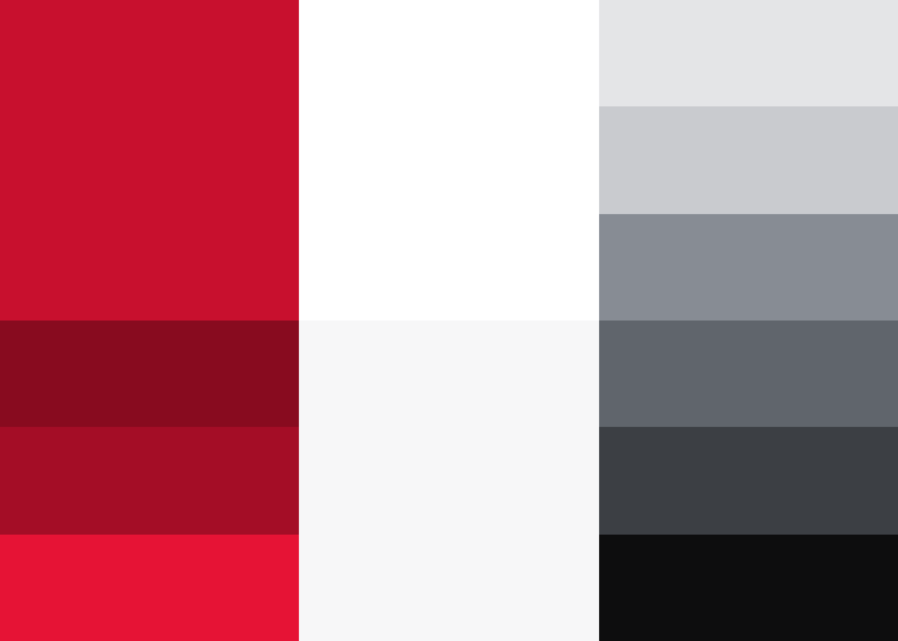
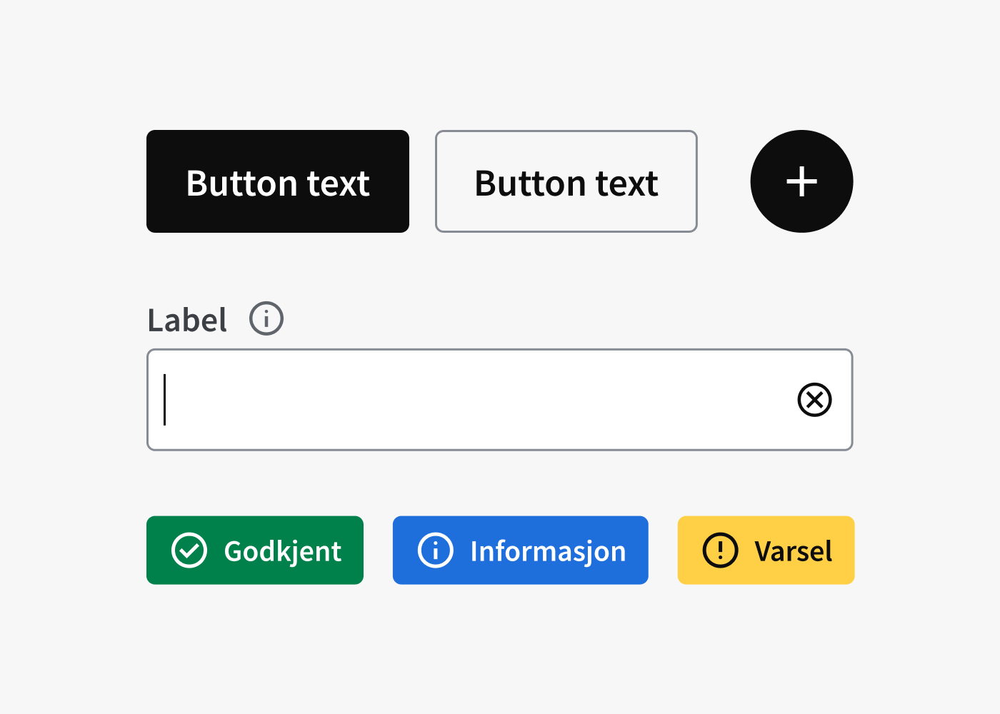

<PageHeader title="For designere" imagePath="designer"  pageLevel=2></PageHeader>
TODO: Legge til tab komponent

Designsystem samler og tilgjengeliggjør verktøy, filer, komponenter og designretningslinjer som brukes av designere og utviklere for å lage gode og konsekvente brukeropplevelser i NVE og Varsoms digitale tjenester.

## Hva betyr det for deg som designer?

Designere skal i størst mulig grad bruke komponentene og mønstrene i designsystemet når de designer nye tjenester for NVE eller Varsom. Dette sørger for at alle tjenestene gir en konsekvent og god brukeropplevelse. Alle bestanddelene i designsystemet er koblet opp med felles tokenverdier (f.eks. farger, avstander og fonter), og det gjør det også enkelt å gjøre justeringer på et overordnet nivå som påvirker alle komponenter og mønstre.

## Struktur i Figma
NVE har egen organisajonskonto i Figma, noe som gjør at vi kan samle alle prosjekter under en organisasjon. Derifra kan vi tilgjengeligjøre innholdet i designsystemet til alle prosjekter. Det gjør at vi må være systematiske i hvordan vi jobber med distribusjon fra designsystemet.

I designsystemet finnes det flere filer, som gjør at vi har mulighet til å distribuere deler av designsystemet på en mer oversiktlig måte. Det gjør også at du ute i prosjekt kan skru av og på de filene du ønsker.

Vi har valgt å skille ut farger og ikoner  fra "Primitiver" fila, for at det skal bli mer oversiktlig når du jobber med ditt design. Skjer det endringer, kan du enklere se hvilken fil endringen kommer fra.

Under kan du se en oversikt over alle filer som gjør opp designsystemet i Figma og hva som er i de.

  
  

    <h2 class="h2-style">Primitiver</h2>
    
Dette er de visuelle elementene som trengs for å skape engasjerende og brukervennlig design. Her finner du veiledning om typografi, grafiske elementer, layout og struktur. Det presenterer også design tokens.

    <LinkButton URL="https://nve.frontify.com/" text="Åpne i Figma" :openInNewTab="true"/>
  

  
  

    <h2 class="h2-style">Farger</h2>
    
Farge-filen i Figma er der alle fargene ligger. Ved å aktivere denne får du tilgang til NVE og Varsom sine light og darkmode farger.

    <LinkButton URL="https://nve.frontify.com/" text="Åpne i Figma" :openInNewTab="true"/>
  

  
  

    <h2 class="h2-style">Ikoner</h2>
    
Ikon-filen er en samling av alle NVE og Varsoms ikoner som brukes i komponenter i dag. Der kan du også hente ut ikoner fritt om du lager en komponent.

    <LinkButton URL="https://nve.frontify.com/" text="Åpne i Figma" :openInNewTab="true"/>
  

  
  

    <h2 class="h2-style">Komponenter</h2>
    
Komponenter er de gjenbrukbare byggesteinene i designsystemtet. Hver komponent oppfyller et spesifikt interaksjons- eller brukergrensesnitt-behov, og er spesielt laget for å fungere sammen.

    <LinkButton URL="https://nve.frontify.com/" text="Åpne i Figma" :openInNewTab="true"/>
  

  
  

    <h2 class="h2-style">Mønstre</h2>
    
Mønstre er sammensatte komponenter for å løse vanlige brukersituasjoner. Disse løsningene vil sikre at vi har samme brukerflyt og konsistente opplevelse på tvers av applikasjoner og nettsider.

    <LinkButton URL="https://nve.frontify.com/" text="Åpne i Figma" :openInNewTab="true"/>
  

  
  

    <h2 class="h2-style">Malvverk</h2>
    
Malverk er en fil hvor du kan dra inn ferdige maler, og "detache" dem for å få spare tid , istedenfor å sette opp en side med grunnelementer som uansett må med.

    <LinkButton URL="https://nve.frontify.com/" text="Åpne i Figma" :openInNewTab="true"/>
  

