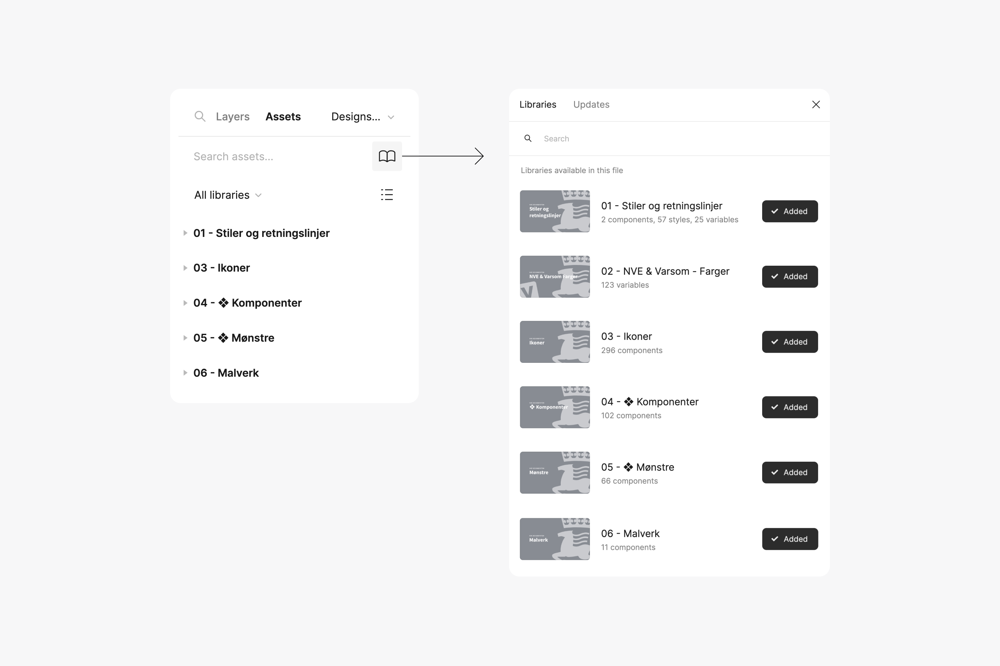
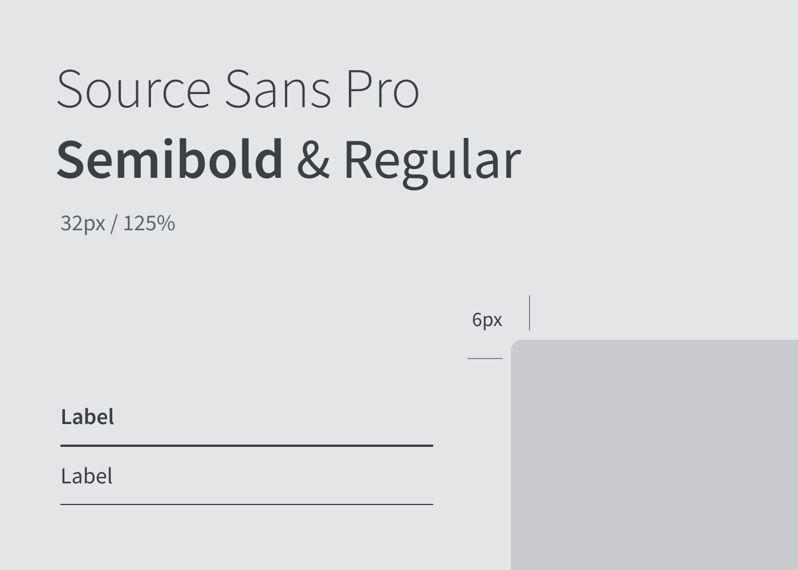
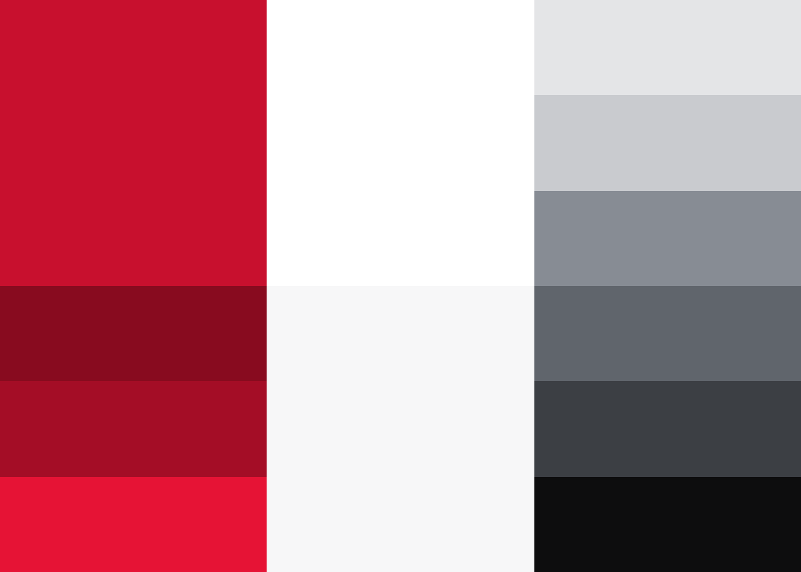
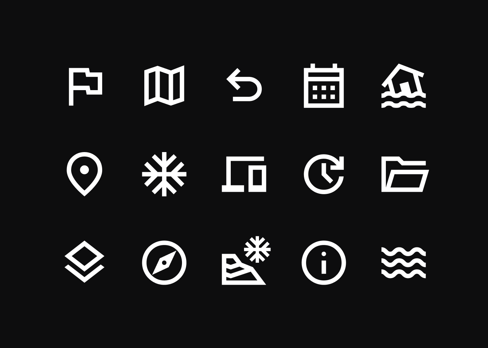
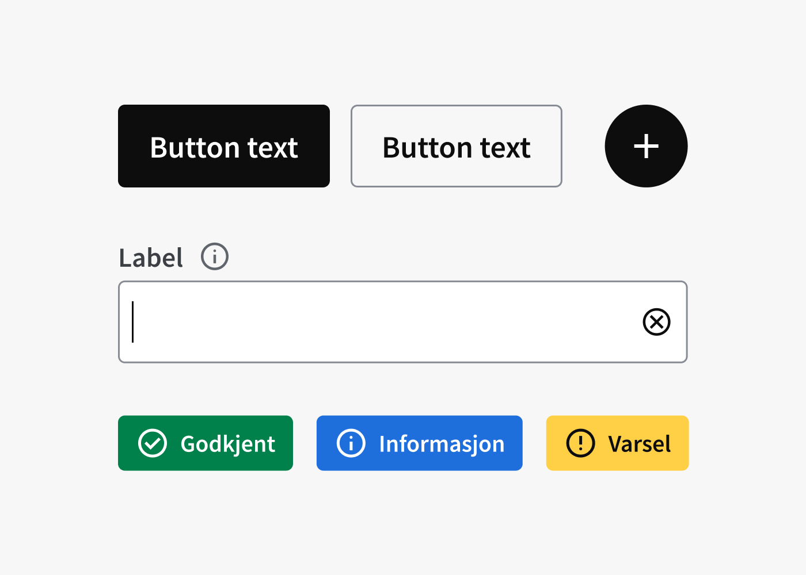
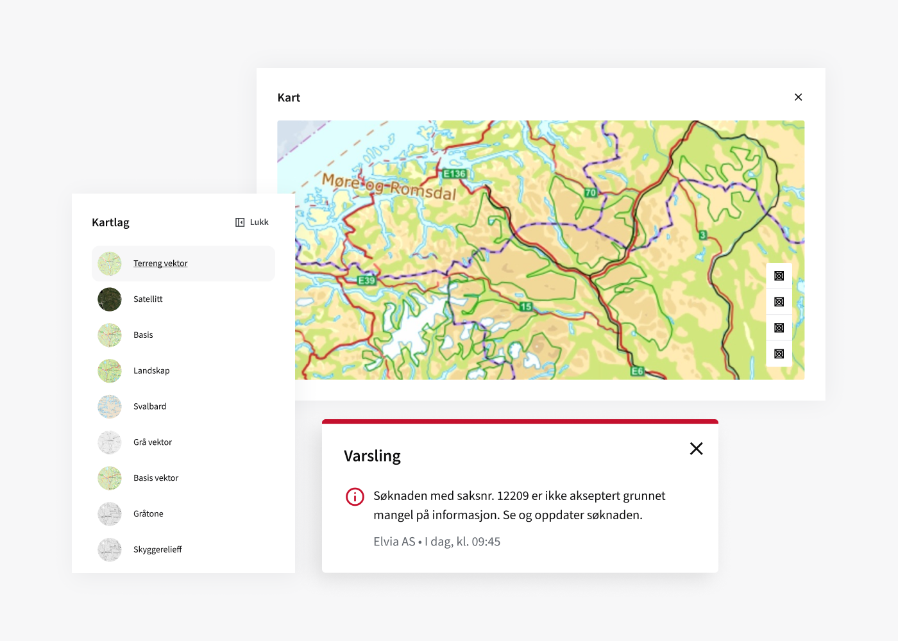
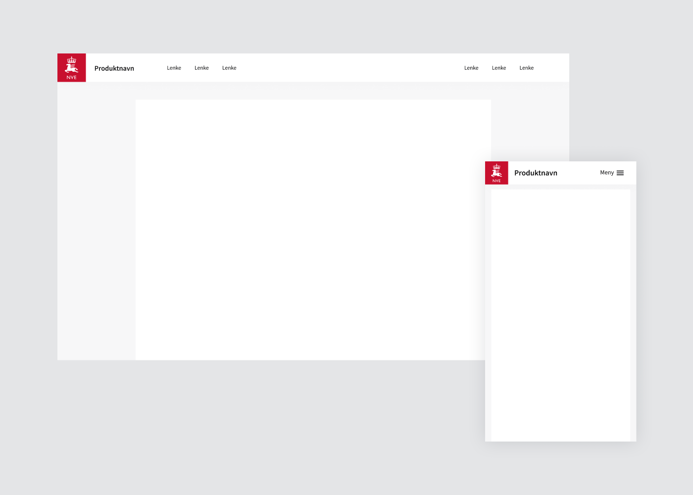
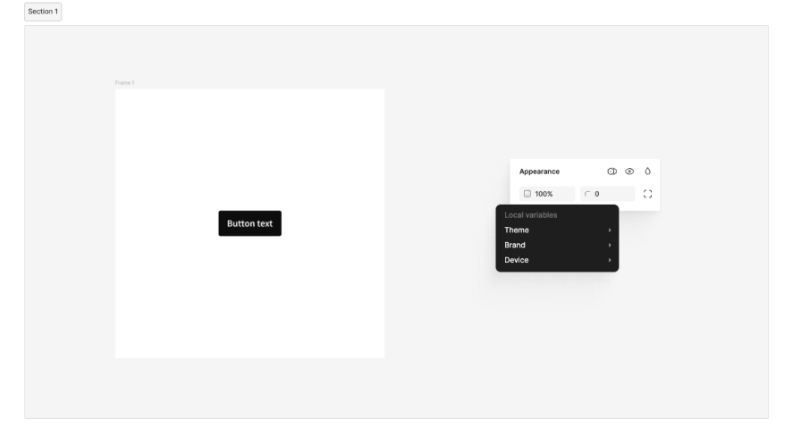

<PageHeader title="For designere" imagePath="designer"  pageLevel=2></PageHeader>

# Bruk av designsystemet i Figma

## Aktiver Designsystemet i Figma om du ikke finner NVE komponenter

For å kunne bruke designsystemet må du aktivere denne i Figma. Alle komponentnavn har “NVE-” foran komponentnavnet. Hvis du ikke finner dette må du følge disse trinnene.

1. Trykk deg inn på library ikonet i en arbeidsfil <nve-icon name="import_contacts" style="display: inline; padding-left:8px;"></nve-icon>

2. Der skal designsystem-filene ligge. Den er delt i 6 deler. Fil 01, 02 og 03 er grunnleggende og må aktiveres før bruk.

## Struktur i Figma

NVE har egen organisajonskonto i Figma, noe som gjør at vi kan samle alle prosjekter under en organisasjon. Derifra kan vi tilgjengeligjøre innholdet i designsystemet til alle prosjekter. Det gjør at vi må være systematiske i hvordan vi jobber med distribusjon fra designsystemet.

I designsystemet finnes det flere filer, som gjør at vi har mulighet til å distribuere deler av designsystemet på en mer oversiktlig måte. Det gjør også at du ute i prosjekt kan skru av og på de filene du ønsker.

Vi har valgt å skille ut farger og ikoner fra "Primitiver" fila, for at det skal bli mer oversiktlig når du jobber med ditt design. Skjer det endringer, kan du enklere se hvilken fil endringen kommer fra.

Under kan du se en oversikt over alle filer som gjør opp designsystemet i Figma og hva som er i de.

  
  

    <h2 class="h2-style">Primitiver</h2>
    
Dette er de visuelle elementene som trengs for å skape engasjerende og brukervennlig design. Her finner du veiledning om typografi, grafiske elementer, layout og struktur. Det presenterer også design tokens.

    <LinkButton URL="https://nve.frontify.com/" text="Åpne i Figma" :openInNewTab="true"/>
  

  
  

    <h2 class="h2-style">Farger</h2>
    
Farge-filen i Figma er der alle fargene ligger. Ved å aktivere denne får du tilgang til NVE og Varsom sine farger.

    <LinkButton URL="https://nve.frontify.com/" text="Åpne i Figma" :openInNewTab="true"/>
  

  
  

    <h2 class="h2-style">Ikoner</h2>
    
Ikon-filen er en samling av alle ikoner som brukes i komponenter i dag. Der kan du også hente ut ikoner fritt om du lager en komponent.

    <LinkButton URL="https://nve.frontify.com/" text="Åpne i Figma" :openInNewTab="true"/>
  

  
  

    <h2 class="h2-style">Komponenter</h2>
    
Komponenter er de gjenbrukbare byggesteinene i designsystemtet. Hver komponent oppfyller et spesifikt interaksjons- eller brukergrensesnitt-behov, og er spesielt laget for å fungere sammen.

    <LinkButton URL="https://nve.frontify.com/" text="Åpne i Figma" :openInNewTab="true"/>
  

  
  

    <h2 class="h2-style">Mønstre</h2>
    
Mønstre er sammensatte komponenter for å løse vanlige brukersituasjoner. Disse løsningene vil sikre at vi har samme brukerflyt og konsistente opplevelse på tvers av applikasjoner og nettsider.

    <LinkButton URL="https://nve.frontify.com/" text="Åpne i Figma" :openInNewTab="true"/>
  

  
  

    <h2 class="h2-style">Malvverk</h2>
    
Malverk er en fil hvor du kan dra inn ferdige maler, og "detache" dem for å få spare tid , istedenfor å sette opp en side med grunnelementer som uansett må med.

    <LinkButton URL="https://nve.frontify.com/" text="Åpne i Figma" :openInNewTab="true"/>
  

## Bytte tema, brands og skjermstørrelse

Designsystemet er satt opp på en måte at du bruker samme komponent men kan overskrive med NVE eller Varsom som brand. Samme gjelder om du ønsker å implementere dark eller lightmode i løsningen.
Du kan enkelt sette themes ved å bare bruke variabler og komponenter fra designsystemet.

Theme - Kan du bytte mellom dark og light-mode.  
Brand - Bytter du mellom NVE og Varsom sitt design.  
Device - Kan du bytte mellom forskjellige skjermstørrelser. Da vil innholdet justere seg i forhold til hvilken flate du jobber på.

<nve-message-card label="Tips" size="compact">For at dette skal fungere sømløst må du huske på å bruke variablene som er fastsatt - ikke løse designverdier. Da vil ikke alt av innholdet endres i forhold til hva slags variabler/tokens du bruker.</nve-message-card>
