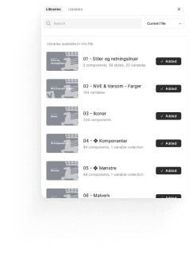
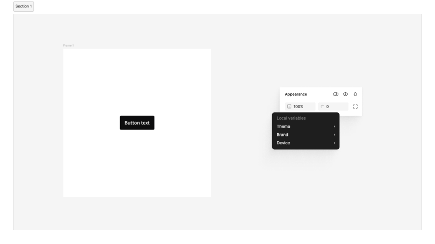
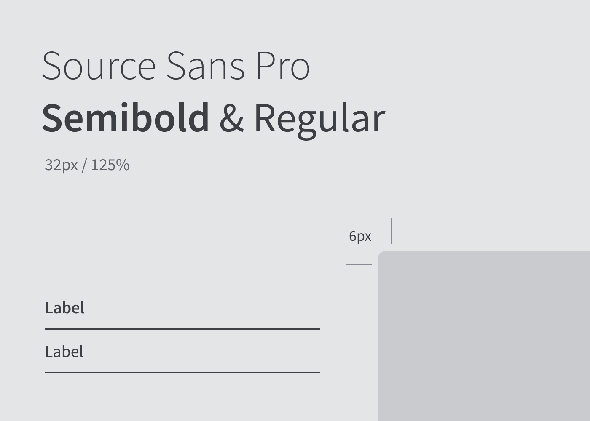
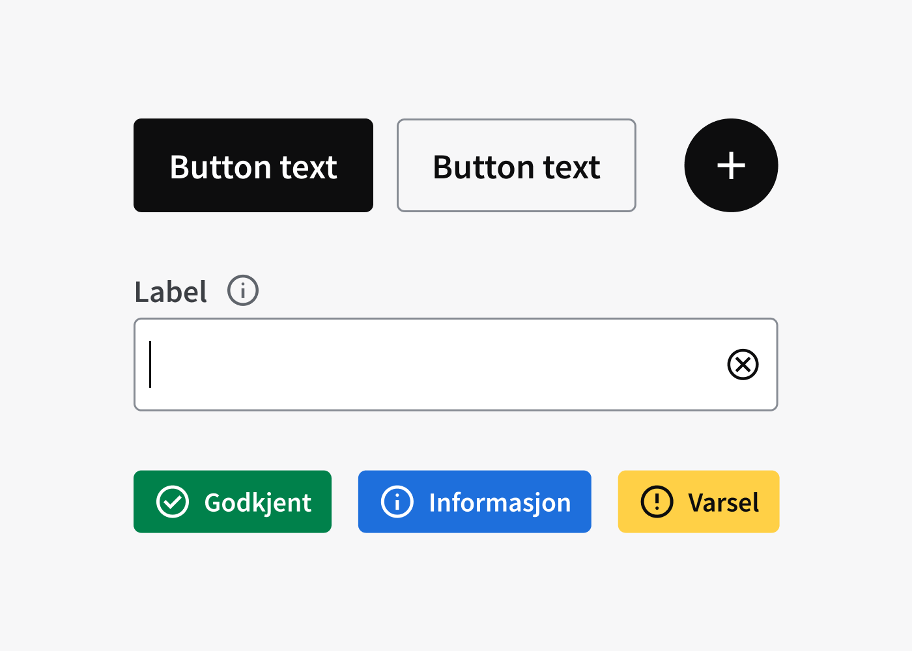
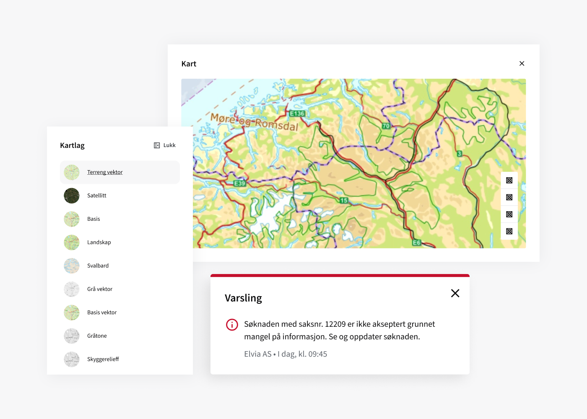

<PageHeader title="For designere" imagePath="designer"  pageLevel=2></PageHeader>

# Kom igang

## Før du starter

Før du starter å bruke designsystemet, er det flere viktige skritt og forberedelser du bør gjøre for å sikre en jevn og vellykket integrasjon av designsystemet i dine prosjekter.

- Gjør deg kjent med NVE og Varsom sine profilmanualer
- Sett deg inn i komponentbiblioteket i Figma
- Få oversikt over hvilke andre designprosjekter som er aktive
- Bli med i kanalen "Design og UX" og "Designsystemet" på NVE Teams

## Jobb sammen

Alle som er en del av prosjektet bør ha tilgang på Figma-filene. Derfor er det viktig å legge dem til i Teamet. Da kan alle kommentere, se status og hente ut kode. Det er derfor også viktig at du legger ting opp på en ryddig og organisert måte slik at det er mulig for andre å forstå.

## Aktiver Designsystemet i Figma om du ikke finner NVE komponenter

For å kunne bruke designsystemet må du aktivere denne i Figma. Alle komponentnavn har “NVE-” foran komponentnavnet. Hvis du ikke finner dette må du følge disse trinnene.

1. Trykk deg inn på library ikonet i en arbeidsfil <nve-icon name="import_contacts" style="display: inline; padding-left:8px;"></nve-icon>

2. Der skal designsystem-filene ligge. Den er delt i 6 deler. Fil 01, 02 og 03 er grunnleggende og må aktiveres før bruk.
   

## Bytte tema, brands og skjermstørrelse

Designsystemet er satt opp på en måte at du bruker samme komponent men kan overskrive med NVE eller Varsom som brand. Samme gjelder om du ønsker å implementere dark eller lightmode i løsningen.
Du kan enkelt sette themes ved å bare bruke variabler og komponenter fra designsystemet.

Theme - Kan du bytte mellom dark og light-mode.  
Brand - Bytter du mellom NVE og Varsom sitt design.  
Device - Kan du bytte mellom forskjellige skjermstørrelser. Da vil innholdet justere seg i forhold til hvilken flate du jobber på.

<nve-message-card label="Tips">For at dette skal fungere sømløst må du huske på å bruke variablene som er fastsatt - ikke løse designverdier. Da vil ikke alt av innholdet endres i forhold til hva slags variabler/tokens du bruker.</nve-message-card>

## Bestanddeler

Designsystemet består av grunnleggende stiler og komponenter som brukes for å designe digitale tjenester for NVE. Vi deler bestanddelene inn i tre kategorier: Primitiver, komponenter og mønstre.

  
  

    <h2 class="h2-style">Primitiver</h2>
    
Primitiver (også kalt foundations) er de mest grunnleggende byggeklossene og retningslinjene for design i NVE.
    Det er kommunikasjonsavdelingen i NVE som forvalter NVE og Varsom sine profilmanualer, som utgjør grunnlaget for primitiver i designsystemet. Profilmanualene finner du under NVE profil og Varsom profil..

  

  
  

    <h2 class="h2-style">Komponenter</h2>
    
Komponenter er enkle grafiske elementer som bygges opp gjennom våre designprinsipper. Komponentene skal være fleksible å bruke, og tilby flere valg og varianter.

  

  
  

    <h2 class="h2-style">Mønstre</h2>
    
Er en sammensetning av flere komponenter sammen. Dette er mer enn 4-5 komponenter satt sammen for å danne et mer komplekst grensesnittelement.

Dette kan for eksempel være en header/navigasjonsbar eller et “cookies” panel som kommer opp.

  

